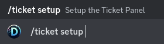

# Tickets


This system is for advanced users


## Introductions

The ticket system always has the same structure and is started with the command `/ticket setup`

<figure><figcaption></figcaption></figure>

This command creates a simple embed which you can set and then you start with a type. So either Buttons or SelectMenus you start this setup with `/ticket button` or `/ticket selectmenu`

Use the two commands to start the setup for a ticket setup. Everything about it is adjustable and individual for an option in the select menu or button. (_Small info: You can get the message URL by right clicking on the message_)

We will only test the whole thing with a select menu.

<figure><figcaption></figcaption></figure>

Execute this command and a modal will open which you fill in with your information.

<figure><figcaption></figcaption></figure>

Once you have done this, click on “Submit” and you will be taken to a new window where you can now set everything as you wish.

<figure><figcaption></figcaption></figure>

Click through and create your ticket setup you can use the [placeholder.md](../customisation/placeholder.md "mention") from the ticket system and also the [message-templates.md](../customisation/message-templates.md "mention")(you use this to create your message for this you will find everything in the docs under [message-templates.md](../customisation/message-templates.md "mention")).

When you are done click on “Save the Ticket Option”. And you can now use your ticket immediately. The same works with the buttons so /`ticket buttons`

## Support

You need help or want to have something extra or have an idea that everyone needs then please post on the Discord
